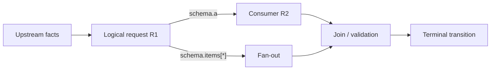
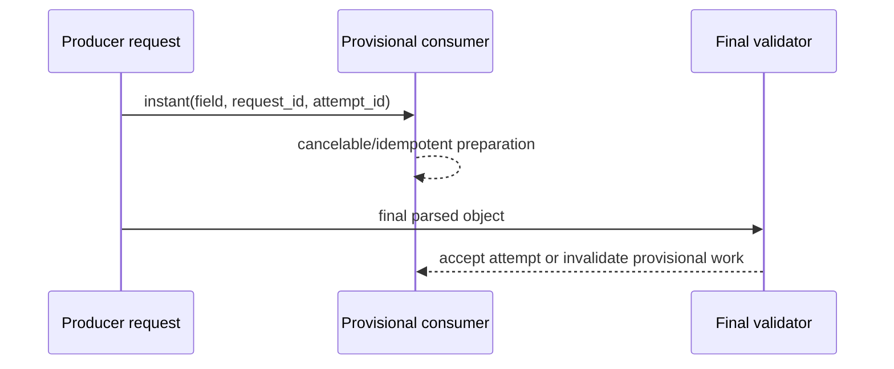

# ModelRequest Topology Design and Audit

Model-request topology is an analysis view of logical ModelRequest nodes and
their information edges. Each node has a prompt-slot/output-schema contract;
each field maps to point-to-point, fan-out, join, UI-stream, or terminal
consumers. `instant` fields are provisional, correlated to one attempt, and
invalidated when that attempt fails or is replaced. Audits reconstruct actual
requests and edges, then diff observed topology against the planned topology.

Core chain:

```text
upstream facts
-> current prompt contract
-> output schema / instant field events
-> point-to-point, fan-out, or join consumer
-> state transition
```

This view does not own executable TriggerFlow definitions and does not own
submitted TaskDAG data.

Focused retrieval summary:

- consumer scopes are `same-response:<later_field>`,
  `next-pass:<node.field>`, `external:<owner>`, and
  `user-process:<status_or_explanation>`;
- a bounded task-specific deliberation artifact may be request-local and later
  discarded when its consumption contract names a later field or pass;
- hidden chain-of-thought and generic unannotated `reasoning`, `analysis`, or
  `thinking` fields are not output contracts;
- shared input, authorization, validation, retry, and lifecycle favor one
  ordered ModelRequest; independent boundaries require a next-pass request;
- a field's claimed quality benefit remains a design hypothesis until
  representative comparison or controlled A/B evidence supports it.

## Planned and Observed Views

- planned topology states which logical requests should exist, what each knows,
  what it produces, and which consumer may act;
- observed topology is reconstructed from execution/task/request/attempt/action
  lineage, prompt/schema fingerprints, field events, state transitions, and
  artifact readback;
- the topology diff finds missing, extra, reordered, retried, widened, or
  disconnected nodes and edges.

A logical request expresses one application decision. A provider attempt is one
try to satisfy it. Retries, repair, fallback, and provider failover create more
attempts without necessarily creating more logical requests. Count both.



## Minimum Planning Topology Contract

Planning topology is a design contract, not a slogan or a diagram added after
implementation. Before choosing APIs, record the smallest useful version of
these four ledgers.

Owner and invariant ledger:

| concern | ownership class | owner | invariant | validation |
|---|---|---|---|---|
| business intent | model-owned semantic | ModelRequest | one declared intent label and evidence basis | model output schema plus offered enum |
| offered-key membership | host-owned deterministic | host code | returned key belongs to the offered set | exact set lookup |
| route decision | hybrid decision | model then host | semantic choice is model-owned; dispatch is host-owned | enum/key validation before dispatch |

Planned node ledger:

| node | owner | decision/role | input boundary | output contract | split reason | lifecycle |
|---|---|---|---|---|---|---|

Planned edge ledger:

| producer | value/signal/state/effect | consumer | edge | maturity | validation | missing/invalid behavior |
|---|---|---|---|---|---|---|

Production-necessity ledger:

| producer.artifact | necessity | consumer scope | consumption contract | visibility | retention | quality evidence |
|---|---|---|---|---|---|---|

Use one of these explicit consumer scopes:

- `same-response:<later_field>` when an earlier ordered field is a bounded
  generation scaffold for a later field in the same output contract;
- `next-pass:<node.field>` when a later critique, repair, verification, or
  planning request consumes it;
- `external:<node/action/state/ui/terminal>` when host code or another runtime
  owner consumes it;
- `user-process:<status_or_explanation>` when it creates useful process
  transparency for a user or renderer.

The production-necessity row states why the artifact exists, not merely where
it is stored. `visibility` distinguishes private request-local, operator-only,
and user-visible values. `retention` states whether the value is discarded,
kept as bounded run evidence, or persisted by an authorized owner. `quality
evidence` labels the benefit as a design hypothesis, observed comparison, or
verified A/B effect; the field name alone is never effect evidence.

## Decide Model Participation Before Node Count

Use model-owned semantic work for meaning derived from prose or ambiguous
evidence: intent and scenario recognition, semantic routing, response
generation, relevance and quality judgment, planning, tradeoff decisions, and
ambiguity resolution. Do not replace these responsibilities with tokenization,
word segmentation, keyword tables, substring rules, regex language patterns,
or hand-written scorecards.

Use host-owned deterministic work for schema/type/enum checks, offered-key
membership, canonical id and metadata reconstruction, exact arithmetic and
filtering, authorization, quota, hard policy, lifecycle state, and side-effect
execution. Use a hybrid decision when the model returns a bounded enum,
selection key, plan, or judgment and host code validates and executes it.

Model participation does not automatically require a separate ModelRequest.
Keep work in one ordered contract when supporting fields and the final result
share one request/output-contract boundary, input and evidence boundary,
authorization, lifecycle, validation, and retry policy, and no intermediate
artifact needs an independently governed consumer lifecycle. Create a separate
ModelRequest when there is an independent business decision, a different
context or evidence boundary, a distinct output/consumer contract, separate
authorization or model settings, independent retry/repair, parallel execution,
or a separately observable lifecycle. If strict pass isolation or independent
validation is required, do not rely only on field order; use an explicit
next-pass node.

## Structured Deliberation Without Hidden Thought

Do not request, save, or pass through hidden chain-of-thought. Provider-native
reasoning telemetry is not an application output contract. This does not ban
explicit structured deliberation artifacts needed by a complex task.

Use a bounded, task-specific deliberation artifact when a later field, request,
workflow step, or user-facing process view consumes it. Prefer semantic names
such as `requirements_analysis`, `evidence_assessment`,
`candidate_tradeoffs`, `decision_factors`, `repair_diagnosis`,
`execution_plan`, or `self_check`. For each artifact, declare:

- its deliberation role and the exact question it resolves;
- its input and evidence boundary;
- its type, requiredness, bounds, and field-level semantics;
- its consumption contract and later consumer;
- its visibility and retention policy;
- its quality evidence status and failure behavior.

For example, an ordered one-request contract may use:

```text
requirements_analysis
  -> candidate_tradeoffs
  -> final_decision
```

The first two fields may be request-local and discarded after the final result,
yet they still have a `same-response` consumer. Their descriptions must say how
`final_decision` synthesizes them. If a repair loop needs the diagnosis after
the attempt ends, declare `next-pass:repair_plan` and retain only the bounded
artifact needed by that pass.

A generic `reasoning`, `analysis`, or `thinking` field with no semantic
annotation, bounds, consumption contract, visibility, or retention rule is an
anti-pattern. It may add tokens, but its existence alone neither defines a
useful reasoning loop nor proves a quality improvement. Important quality
claims require representative comparison or controlled A/B evidence.

## ModelRequest Node Contract Card

Record for every logical node:

| Field | Question |
|---|---|
| id and owner | Which stable logical id and application stage own it? |
| decision | What business decision or transformation occurs? |
| prerequisites | Which trusted facts, capabilities, and prior fields are required? |
| prompt slots | What enters `agent`, `input`, `info`, `instruct`, `output`, `attachment`, and `chat_history`? |
| execution context | Which state, Workspace refs, settings, provider, and authorization apply? |
| output schema | What are each field's type, meaning, requiredness, enum/format/range/nullability, and cross-field rules? |
| consumers | Which same-response field, next pass, request, Action, UI, join, state transition, or terminal gate reads each field? |
| maturity | Is the field final-only, provisionally streamable, or attempt-local? |
| failure | What invalidates it, and which retry/repair/terminal rule follows? |
| observation | Which lineage, fingerprints, bounded previews, sizes, timing, and status prove the edge? |

## Prompt-Slot Review

- `agent`: persistent role, policy, and stable capabilities only;
- `input`: current runtime values, source facts, and task-scoped identifiers;
- `info`: authoritative docs, schema, signatures, docstrings, evidence, and
  bounded context needed to decide correctly;
- `instruct`: transformation, decision, call, and safety rules;
- `output`: exact machine-consumable type and field-level contract;
- `attachment`: rich content whose ordering or modality matters;
- `chat_history`: relevant conversation continuity, not an unbounded transcript;
- execution context: state, Workspace refs, attempt and lineage ids;
- settings: provider/model/runtime configuration, kept outside business prompts.

When output must call a documented interface, put runtime facts in `input`,
authoritative contract material in `info`, call rules in `instruct`, and the
exact downstream shape in `output`. Deterministically validate before the call.

## Design Edges Before Schema

An output field is an orchestration contract when any later request, Action,
join, UI renderer, state transition, or terminal gate consumes it. Start with
those consumers, then decide field granularity and validation.

| Edge | Design requirement |
|---|---|
| point-to-point | one producer, one authorized consumer, explicit missing-value rule |
| fan-out | stable item identity, concurrency owner, per-item status, collection rule |
| join | required branches, partial/failure policy, aggregation scope, final barrier |
| UI stream | stable business event, provisional marker, attempt correlation, invalidation |
| terminal | final validation, side-effect authorization, explicit completion status |

Do not publish raw parser paths as the application protocol. Map them to stable
business fields or events owned by the application or TriggerFlow layer.

## Instant Maturity and Invalidation

`instant` updates can drive UI or explicitly cancelable/idempotent preparation.
They cannot authorize irreversible effects or final business decisions. Carry
logical request id, provider attempt id, field path, maturity, and sequence.
When an attempt fails, is repaired, or is superseded, invalidate its provisional
values. Cross the final validation barrier only after the same result provides
its parsed final data and configured validation passes.

### Start, cache, reconcile

Use one explicit three-phase contract when a completed early field can start
useful work while the model continues generating:

1. **start** — put compact trigger records before long explanation or artifact
   fields; act only when the canonical field or list item is complete;
2. **cache** — derive a host-owned key from the task-relevant payload and start
   only idempotent/cancelable work, under the owning concurrency limit;
3. **reconcile** — after `async_get_data()` returns the final validated object,
   reuse matching work, start accepted items that were not observed
   provisionally, and cancel or discard provisional extras.

The stream loop must keep consuming model output after dispatch. Awaiting each
retrieval, tool call, or preparation inline merely moves the serial bottleneck
into the parser loop. Use TriggerFlow managed non-blocking signals when the
fan-out and join are application-visible.

Prefer generating all compact trigger records first, followed by a short
user-safe progress explanation and then the expensive structured artifact.
Interleaving a long explanation after every trigger delays later independent
work without improving its inputs. An exception is a consumer that genuinely
needs each explanation before it may authorize the next trigger.

Final reconciliation is mandatory even when provider retry markers are handled.
Output parsing, ensure checks, or custom validation can accept a replacement
attempt after the original instant stream has ended; final accepted items are
the authority. Provider retries and repeated deltas must not create repeated
retrievals or side effects.

A field-start observation may become a stable host-owned status such as
`generating_artifact`. Model-generated progress prose is appropriate only when
its natural-language content is itself useful to the user. Do not expose raw
paths as the frontend protocol.



For large structured generation, a bounded artifact such as
`generation_plan`, `evidence_assessment`, or `risk_checks` may appear before the
large field when a later field, workflow node, or user-process view consumes it.
This is an observable structured contract, not hidden chain-of-thought. Declare
its bounds, consumer, visibility, retention, and failure behavior; a generic
`reasoning` field still does not qualify.

## Schema-to-Flow Map

Maintain a consumer-edge matrix with one row per produced field:

| producer.field | type/maturity | consumer | edge | validation | missing/invalid behavior |
|---|---|---|---|---|---|
| `R1.items[*].key` | string/final | fan-out operator | fan-out | offered-key set | reject unknown key |
| `R1.preview` | string/provisional | UI | stream | bounded text | invalidate attempt |
| `R2.verdict` | enum/final | terminal gate | terminal | required enum | fail closed |

Every consumer must be authorized and every join must say whether partial input
is acceptable. Fields with no declared consumer in any scope are candidates
for removal; request-local fields with a real same-response or next-pass
consumption contract are not unconsumed merely because host code discards them.

## Audit Ledger and First Divergence

Normalize runtime facts into logical requests and provider attempts. Build a
ledger with stage, logical id, attempt id, owner, inputs, prompt/schema
fingerprints, bounded previews, output fields, consumers, timing, usage, status,
and lineage. Then:

1. compare actual nodes and edges with the plan;
2. find the earliest node whose required input was absent or wrong, or the
   earliest edge that dropped, widened, delayed, or misrouted a field;
3. trace later symptoms back to that first divergence;
4. verify the cause with source inspection, direct artifact readback, or a
   controlled A/B change.

Aggregate request counts alone cannot show whether extra calls are legitimate
attempts, repair loops, duplicated logical decisions, or fan-out work.

## Amplification Metrics

Record logical requests, provider attempts, fan-out width, join wait, retry and
repair counts, repeated prompt/context bytes, response bytes, usage, latency,
and external/tool calls. Review:

- request amplification = provider attempts / logical requests;
- context amplification = repeated prompt/context bytes across attempts;
- loop amplification = iterations without new trusted fact, capability, state,
  or narrower hypothesis;
- cost concentration by stage, node, and first divergence.

## Root-Cause Categories

Classify the verified owner: design/owner gap, prompt-contract gap,
schema/consumer mismatch, information/evidence loss, identity join failure,
lifecycle/pressure defect, runtime mechanism defect, provider/infra issue,
instrumentation gap, source/input defect, or artifact-quality defect.

## Audit Report Template

```text
Scope and planned topology:
Observed facts and evidence paths:
Logical request / attempt ledger:
Schema-to-consumer edge matrix:
First divergence:
Observed -> inferred -> verified cause:
Amplification and cost impact:
Fix owner and leaf Skill:
A/B or readback verification:
Remaining limitations:
```

Do not collect hidden chain-of-thought. Audit observable prompts, contracts,
bounded structured deliberation artifacts, events, outputs, state changes, tool
evidence, and artifacts only within their declared visibility and retention
policy, with redaction.
